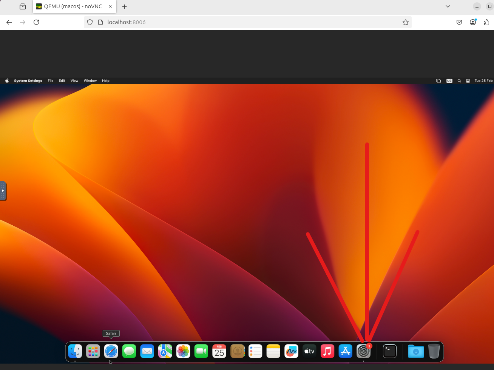
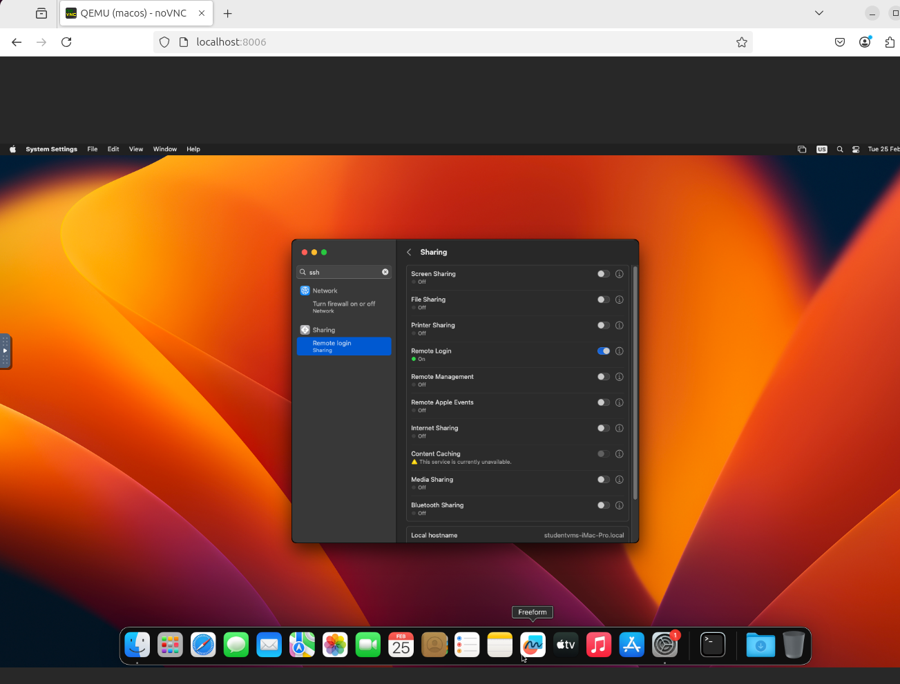
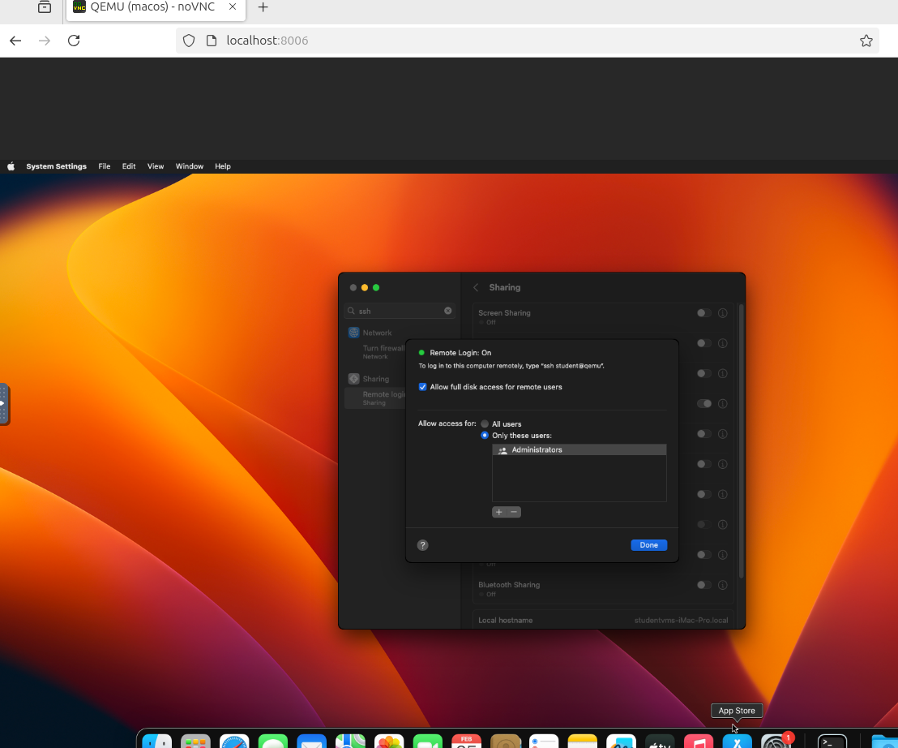

# Setting Up a MacOS Virtual Machine

Follow instructions below to set up a macOS virtual machine.

## Linux

Have KVM installed.
See instructions [here](https://help.ubuntu.com/community/KVM/Installation).

## Windows

Download the [virtual machine file](https://ctipub-my.sharepoint.com/:u:/g/personal/andrei_sorescu_stud_etti_upb_ro/EcSy6oc4NvtEmA3G8_UJ9kIB2MfGm3JHa5avFXyejOSL6A?e=boh5Z6).
Open it in [VMware Workstation](https://www.vmware.com/products/desktop-hypervisor/workstation-and-fusion).
Update to macOS Ventura.

When unpacking the archive, use the password `studenvm`.

The user password inside the virtual machine is `student`.

**Note**: If the importing part does not work, use [this unlocker](https://github.com/DrDonk/unlocker/tree/main).

## macOS

Use any hypervisor.
Or, simply practice on the host, without using a virtual machine.

**Note**: You can skip the Linux prerequisites phase, however, the VM is going to be considerably slower.

## Further Steps

Install [Docker Engine](https://docs.docker.com/engine/install/).
Clone the [dockur/MacOS repository](https://github.com/dockur/macos) and follow the steps to install MacOS.

## Enable SSH

On either host/virtualization solution, in order to enable SSH access, follow the steps below:

1. Open `System Settings`:

   

1. Search for SSH, select remote login and enable remote login:

   

1. Click on the exclamation mark corresponding to the Remote Login and enable `Allow full disk access for remote users`:

   

### Use SSH from Linux

In order to ssh to the VM from a Linux host run the following commands:

```console
sudo docker ps
sudo docker inspect <container ID of the MacOS VM> | grep IP
```

Then, use:

```console
ssh <username>@<IPAddress>
```

If there is any need for interacting with the GUI, it can always be accessed via VNC at localhost:8006.

### Use SSH from Windows

In order to SSH to the VM from a Windows host, follow the steps:

1. Run `ifconfig` inside the virtual machine, get the IP address corresponding to the adapter attached from VMware settings.
1. Use `ssh` from WSL/other VM/Powershell to connect to the VM.

If there is any need for interacting with the GUI, it can always be accessed via VMware workstation dashboard.
